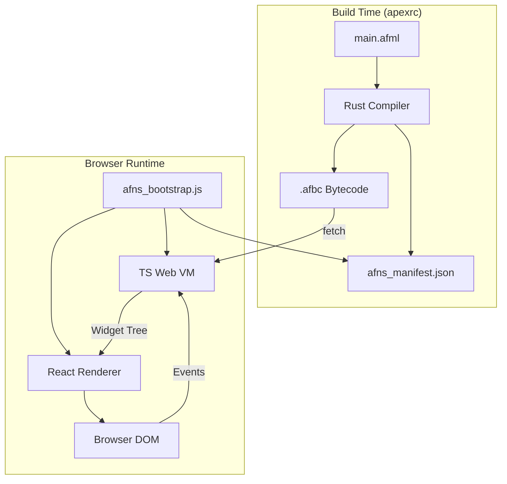

# AFNS GUI Web Architecture (No WASM)

This document explains the Flutter-like GUI system for ApexForge NightScript targeting the web without WebAssembly.

## Overview

AFNS uses a **bytecode + TypeScript VM + React renderer** architecture, similar to how Flutter uses Dart VM + Skia rendering but adapted for web:

```
AFML Source → Rust Compiler → .afbc Bytecode → TS Web VM → React Renderer → DOM
```

> [!IMPORTANT]
> **No WASM anywhere in the web path.** The Rust compiler produces bytecode artifacts; the TypeScript VM executes them in the browser.

## Architecture Diagram



## Key Components

### 1. Bytecode Format (.afbc)

The `.afbc` file is a deterministic binary artifact:

| Section | Description |
|---------|-------------|
| Magic | `"AFBC"` (4 bytes) |
| Version | `u16` (currently 1) |
| Flags | `u32` (reserved) |
| Constants | Pool of strings, ints, floats, bools |
| Functions | Table with name, arity, code offset |
| Bytecode | Raw VM instructions |
| Debug | Optional source map |

**Determinism**: Same AFML input always produces identical `.afbc` bytes.

### 2. TypeScript Web VM

Located in `packages/afns_web_vm/`, the VM:

- Loads and parses `.afbc` files
- Executes bytecode instructions
- Manages widget tree and state
- Handles events from the renderer

### 3. React Renderer

Located in `packages/afns_react_renderer/`, provides:

- React components for each widget type
- Patch application for efficient updates
- Event dispatch back to VM

### 4. Build Output

`apexrc build --target web` produces:

```
target/web/
├── index.html           # Entry point
├── afns_manifest.json   # Build metadata
├── afns_bootstrap.js    # Loader script
├── afns_vm.js           # VM bundle
├── afns_renderer.js     # Renderer bundle
└── afns_app.<id>.afbc   # Compiled app
```

## Build ID and Caching

The **buildId** is computed as:

```
sha256(
  AFML sources +
  Apex.toml +
  compiler version +
  renderer version +
  VM version
).truncate(12)
```

### Cache Rules

| File | Cache-Control |
|------|---------------|
| `index.html` | `no-store` |
| `afns_manifest.json` | `no-store` |
| JS bundles | `no-cache` |
| `.afbc` | Can be cached (versioned name) |

This ensures UI updates propagate immediately in development.

## Comparison to Flutter

| Flutter Web | AFNS Web |
|-------------|----------|
| Dart → WASM or JS | AFML → .afbc bytecode |
| CanvasKit/HTML renderer | React DOM renderer |
| `flutter_bootstrap.js` | `afns_bootstrap.js` |
| Widget rebuild | Widget diff + patch |

## Usage

### Build for Web

```bash
cd examples/ui_hello
apexrc build --target web
```

### Run Dev Server

```bash
apexrc run --target web
# Open http://localhost:3000
```

### Verify Determinism

```bash
./scripts/web_build_proof.sh
```

## Troubleshooting

### Stale UI

If you see old content after changes:

1. Hard refresh the browser (Ctrl+Shift+R)
2. Check `afns_manifest.json` has new buildId
3. Verify Cache-Control headers are `no-store`

### Build Errors

If `apexrc build --target web` fails:

1. Ensure `src/main.afml` exists
2. Check `Apex.toml` is valid
3. Run `cargo build` to rebuild apexrc

### Server Not Starting

If dev server fails:

1. Check port 3000 is available
2. Try a different port: edit dev server code
3. Check for error messages in terminal
